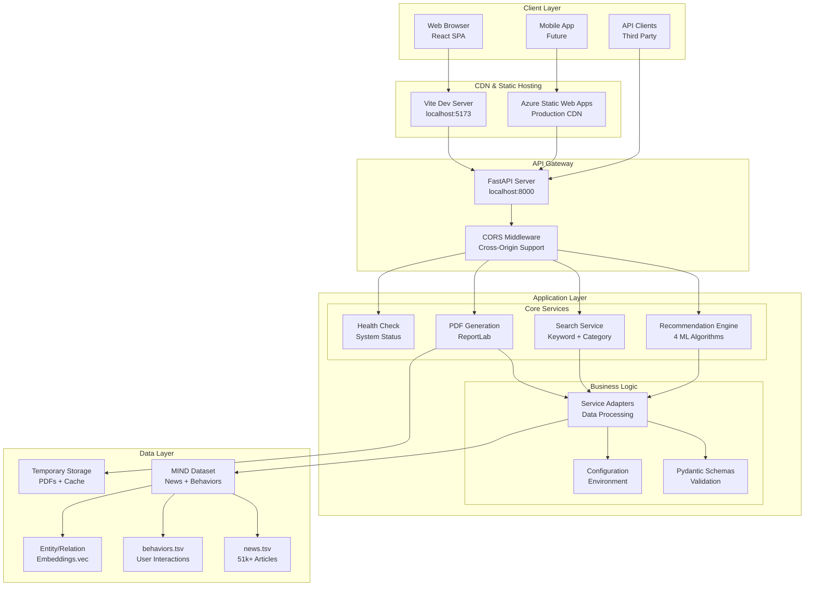

# Smart News Recommendation System

[](https://www.python.org/downloads/)
[](https://reactjs.org/)
[](https://fastapi.tiangolo.com/)
[](https://www.typescriptlang.org/)

A modern, intelligent news recommendation system that provides personalized news suggestions using multiple machine learning algorithms. Built with FastAPI backend and React frontend, featuring real-time recommendations, category filtering, and PDF export capabilities.

## � Features

### Core Functionality
- **Multiple Recommendation Algorithms**: 4 distinct recommendation engines
  - 🤖 **BERT-based Recommendations**: Advanced transformer-based content understanding
  - 🔄 **Hybrid Recommendations**: Combines collaborative and content-based filtering
  - � **Collaborative Filtering**: User behavior-based recommendations
  - 📰 **Content-based Filtering**: Article similarity-based recommendations

- **Smart Search & Filtering**: Advanced keyword search with category filtering
- **PDF Export**: Generate personalized news reports with user identification
- **Real-time Data**: Trending news and personalized feeds
- **Responsive UI**: Modern React interface with TypeScript

### Technical Features
- RESTful API with FastAPI
- CORS-enabled for cross-origin requests
- Microsoft MIND dataset integration
- Professional error handling and validation
- Modular architecture for easy extension

## 🏗️ System Architecture



## 📋 Prerequisites

- **Python**: 3.13.7 or higher
- **Node.js**: 22.14.0 or higher
- **npm**: Latest version
- **Git**: For version control

## 🛠️ Installation

### 1. Clone the Repository
```bash
git clone <your-repo-url>
cd Smart-News-Recommendation-System-main
```

### 2. Backend Setup
```bash
# Create and activate virtual environment
python -m venv .venv
source .venv/bin/activate  # On Windows: .venv\Scripts\activate

# Install dependencies
pip install -r requirements.txt

# Navigate to server directory
cd server
pip install -r requirements.txt
```

### 3. Frontend Setup
```bash
# Navigate to web directory
cd web

# Install dependencies
npm install
```

### 4. Dataset Setup
Ensure the MIND dataset is properly placed in the `MINDsmall_train/` directory:
- `news.tsv`: News articles data
- `behaviors.tsv`: User behavior data
- `entity_embedding.vec`: Entity embeddings
- `relation_embedding.vec`: Relation embeddings

## � Running the Application

### Backend Server
```bash
cd server
python -m uvicorn app.main:app --reload --host 0.0.0.0 --port 8000
```

### Frontend Server
```bash
cd web
npm run dev
```

The application will be available at:
- **Frontend**: http://localhost:5173
- **Backend API**: http://localhost:8000
- **API Documentation**: http://localhost:8000/docs

## 📚 API Documentation

### Core Endpoints

#### Health Check
```http
GET /health
```
Returns system health status.

#### Trending News
```http
GET /trending?limit=10
```
Get trending news articles.

#### Personalized Recommendations
```http
POST /recommend
Content-Type: application/json

{
  "user_id": "user123",
  "algorithm": "bert"  // Options: "bert", "hybrid", "collaborative", "content"
}
```

#### Search with Category Filtering
```http
POST /search
Content-Type: application/json

{
  "query": "technology",
  "category": "tech",  // Optional: filter by category
  "limit": 20
}
```

#### PDF Export
```http
POST /export/pdf
Content-Type: application/json

{
  "articles": [...],
  "user_id": "user123",
  "title": "My News Report"
}
```

## 🧠 Recommendation Algorithms

### 1. BERT-based Recommendations
- Utilizes transformer architecture for content understanding
- Analyzes semantic similarity between articles
- Best for content discovery and relevance

### 2. Hybrid Recommendations
- Combines collaborative and content-based filtering
- Balances user preferences with content similarity
- Provides well-rounded recommendations

### 3. Collaborative Filtering
- Analyzes user behavior patterns
- Recommends based on similar users' preferences
- Effective for discovering trending content

### 4. Content-based Filtering
- Focuses on article content similarity
- Recommends articles similar to user's reading history
- Great for topical consistency

## � Frontend Features

### Components
- **ArticleCard**: Displays individual news articles
- **RecommendationPage**: Personalized recommendations with algorithm selection
- **SearchPage**: Advanced search with category filtering
- **PDF Export**: Generate and download personalized reports

### Styling
- Modern CSS with responsive design
- Professional UI components
- Consistent color scheme and typography

## 🔧 Configuration

### Environment Variables
Create `.env` file in the root directory:
```env
# API Configuration
API_BASE_URL=http://localhost:8000

# Dataset paths
MIND_DATASET_PATH=./MINDsmall_train/

# CORS settings
ALLOWED_ORIGINS=["http://localhost:5173", "http://localhost:5174"]
```

### CORS Configuration
The backend is configured to allow requests from:
- `http://localhost:5173` (Vite default)
- `http://localhost:5174` (Alternative port)

## � Usage Examples

### Getting Personalized Recommendations
1. Navigate to the Recommendations page
2. Enter your User ID
3. Select recommendation algorithm (BERT, Hybrid, Collaborative, Content)
4. View personalized news feed
5. Export to PDF if needed

### Searching News
1. Use the search bar on the Home page
2. Enter keywords (e.g., "technology", "sports")
3. Optionally select a category filter
4. Browse filtered results

### Exporting Reports
1. Generate recommendations or search results
2. Click "Export PDF" button
3. Download personalized news report

## 🧪 Testing

Run the test suite:
```bash
# Backend tests
cd server
python -m pytest tests/

# Frontend tests
cd web
npm run test
```

## 📦 Deployment

### Docker Deployment
```bash
# Build and run with Docker Compose
docker-compose up --build

# Access application
# Frontend: http://localhost:3000
# Backend: http://localhost:8000
```

### Production Deployment
Refer to `DEPLOYMENT.md` for detailed production deployment instructions including:
- Azure deployment
- Environment configuration
- SSL setup
- Performance optimization

## 🤝 Contributing

1. Fork the repository
2. Create a feature branch (`git checkout -b feature/amazing-feature`)
3. Commit your changes (`git commit -m 'Add amazing feature'`)
4. Push to the branch (`git push origin feature/amazing-feature`)
5. Open a Pull Request

## 📄 License

This project is licensed under the MIT License - see the [LICENSE](LICENSE) file for details.

## 🙏 Acknowledgments

- **Microsoft MIND Dataset**: For providing the news dataset
- **FastAPI**: For the excellent web framework
- **React**: For the frontend framework
- **scikit-learn**: For machine learning algorithms
- **ReportLab**: For PDF generation capabilities

## 📞 Support

For support, please open an issue in the GitHub repository or contact the development team.

---

**Built with ❤️ for intelligent news consumption**
