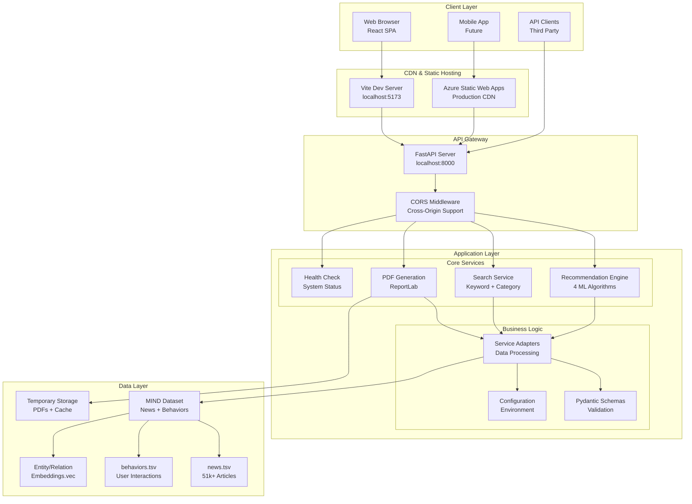
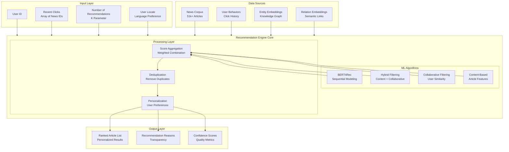
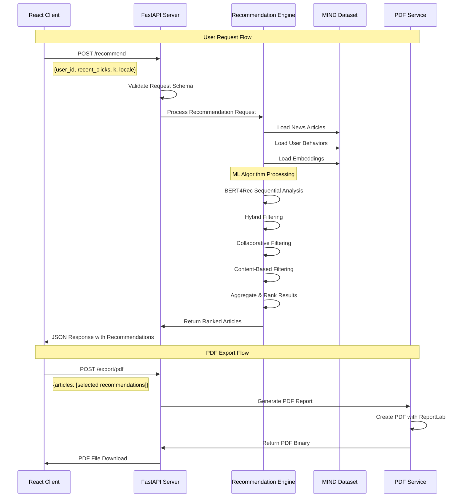
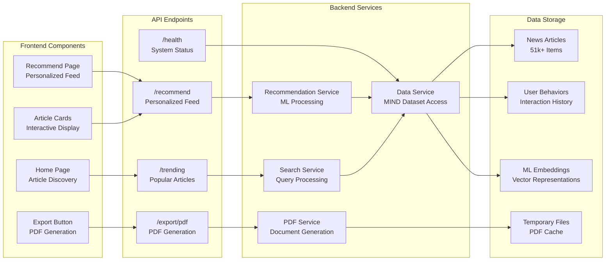
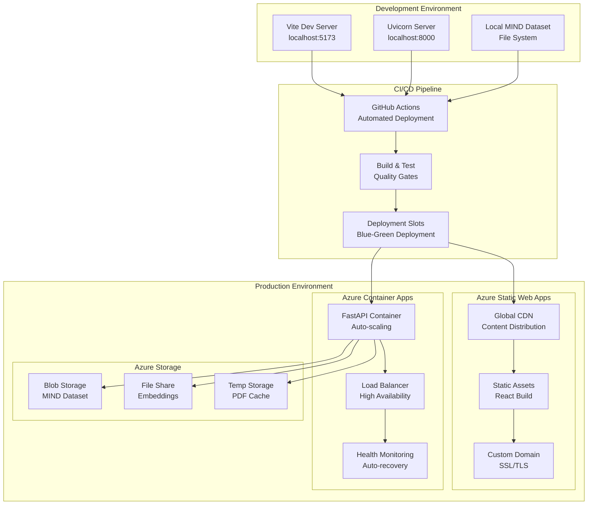
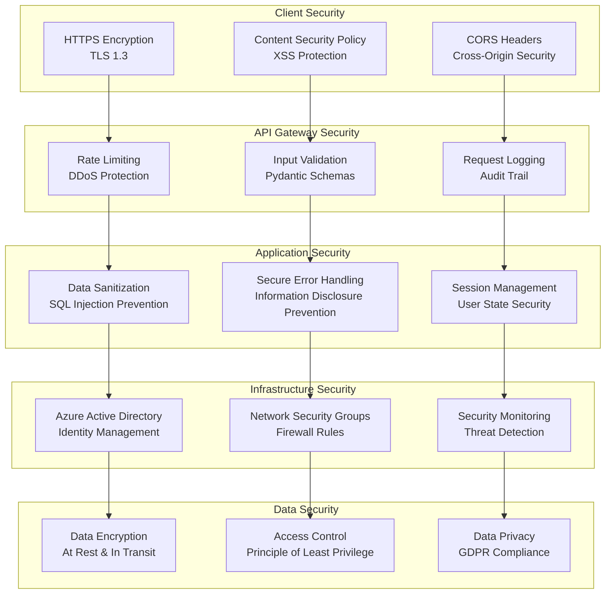
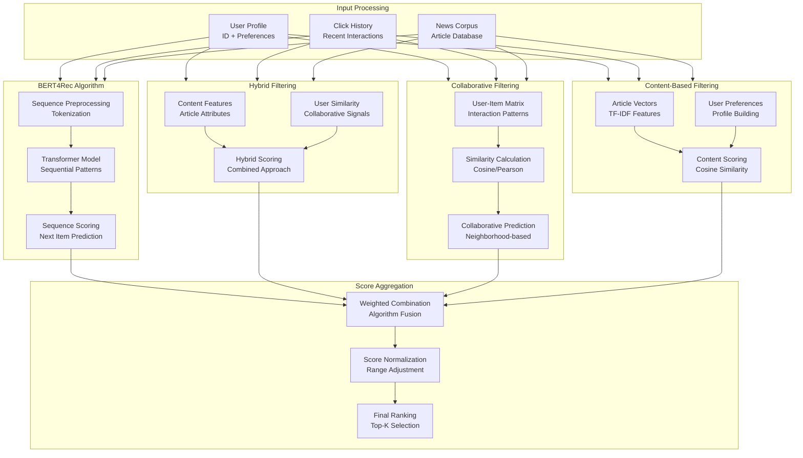
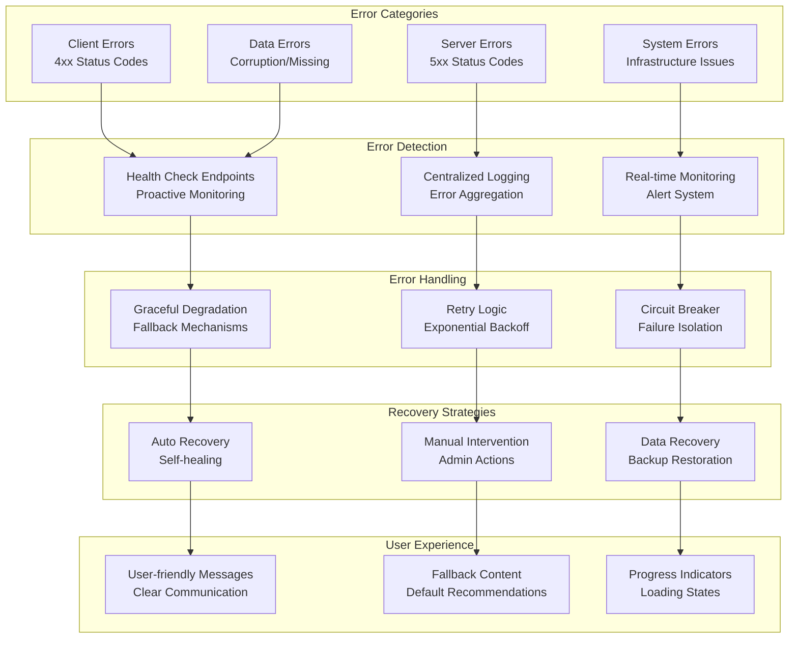

# Smart News Recommendation System - System Diagrams

This document provides comprehensive visual representations of the Smart News Recommendation System architecture and data flows.

## 1. High-Level System Architecture

## 2. Recommendation Engine Architecture

## 3. Data Flow Sequence

## 4. Component Interaction Model

## 5. Technology Stack Overview

```mermaid
flowchart TB
    subgraph FrontendStack["Frontend Technology Stack"]
        React["React 18<br/>Component Library"]
        TypeScript["TypeScript<br/>Type Safety"]
        Vite["Vite<br/>Build Tool & Dev Server"]
        TailwindCSS["Tailwind CSS<br/>Styling Framework"]
    end
    
    subgraph BackendStack["Backend Technology Stack"]
        FastAPI["FastAPI<br/>Python Web Framework"]
        Pydantic["Pydantic<br/>Data Validation"]
        Uvicorn["Uvicorn<br/>ASGI Server"]
        Python["Python 3.9+<br/>Runtime Environment"]
    end
    
    subgraph MLStack["Machine Learning Stack"]
        Transformers["Transformers<br/>BERT Models"]
        NumPy["NumPy<br/>Numerical Computing"]
        Pandas["Pandas<br/>Data Manipulation"]
        SciKitLearn["Scikit-learn<br/>ML Algorithms"]
    end
    
    subgraph DataStack["Data & Storage Stack"]
        TSV["TSV Files<br/>MIND Dataset Format"]
        Embeddings["Vector Embeddings<br/>.vec Files"]
        ReportLab["ReportLab<br/>PDF Generation"]
        JSON["JSON<br/>API Communication"]
    end
    
    subgraph DevOpsStack["DevOps & Deployment Stack"]
        Docker["Docker<br/>Containerization"]
        AzureStaticApps["Azure Static Web Apps<br/>Frontend Hosting"]
        AzureContainerApps["Azure Container Apps<br/>Backend Hosting"]
        GitHub["GitHub Actions<br/>CI/CD Pipeline"]
    end
    
    React --> TypeScript
    TypeScript --> Vite
    Vite --> TailwindCSS
    
    FastAPI --> Pydantic
    Pydantic --> Uvicorn
    Uvicorn --> Python
    
    Transformers --> NumPy
    NumPy --> Pandas
    Pandas --> SciKitLearn
    
    TSV --> Embeddings
    Embeddings --> ReportLab
    ReportLab --> JSON
    
    Docker --> AzureStaticApps
    AzureStaticApps --> AzureContainerApps
    AzureContainerApps --> GitHub
```

## 6. Deployment Architecture

## 7. Security Architecture

## 8. ML Algorithm Flow

## 9. Error Handling & Recovery

---

## Summary

This system architecture provides:

- **Scalable Architecture**: Microservices-based design with clear separation of concerns
- **Modern Technology Stack**: React frontend with FastAPI backend and advanced ML algorithms
- **Robust Data Pipeline**: Efficient processing of the MIND dataset with multiple recommendation strategies
- **Production-Ready Deployment**: Azure-based cloud infrastructure with CI/CD automation
- **Security First**: Comprehensive security measures across all layers
- **Error Resilience**: Robust error handling and recovery mechanisms
- **User-Centric Design**: Focus on performance, usability, and transparency

The system is designed to handle real-world usage patterns while maintaining high performance, reliability, and user satisfaction.