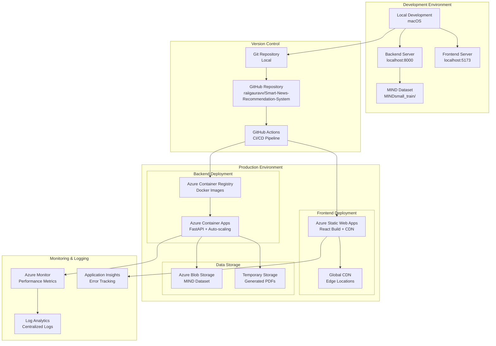
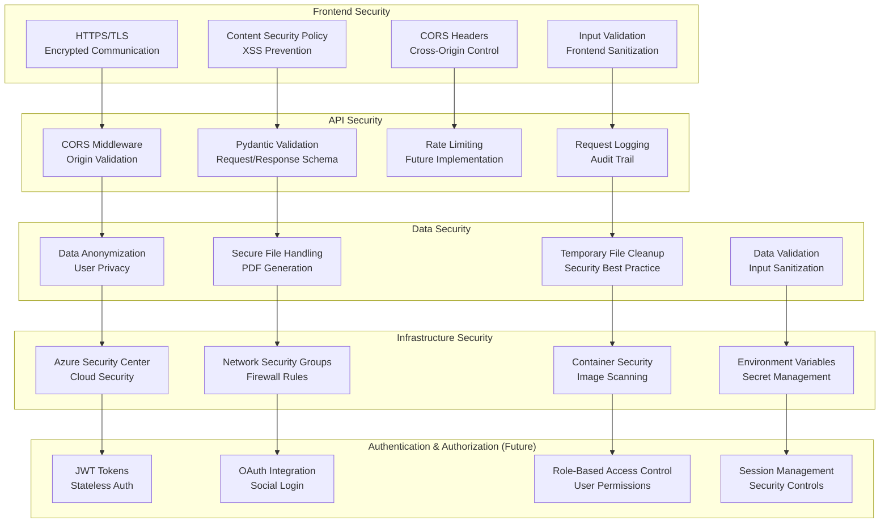
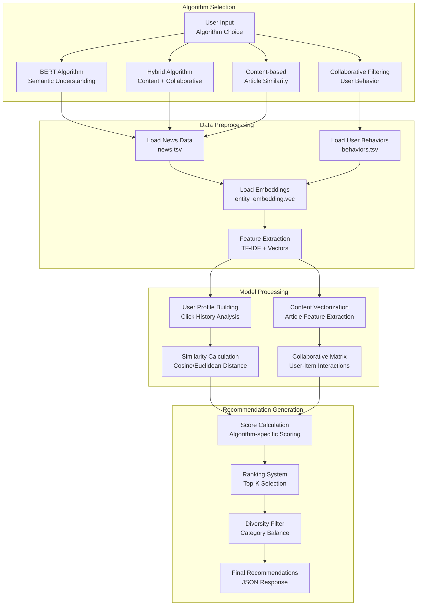
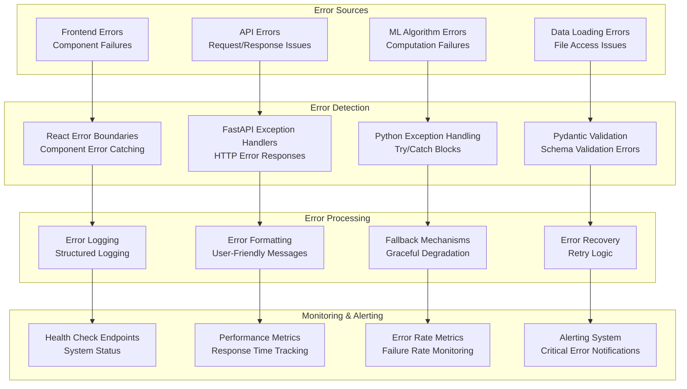

# Smart News Recommendation System - System Diagrams# Smart News Recommendation System - System Diagrams# System Architecture Overview


## High-Level System Design


```mermaid## High-Level System Design## High-Level System Design

flowchart TB

    subgraph Client["Client Layer"]

        Web["Web Browser<br/>React SPA"]

        Mobile["Mobile App<br/>Future"]```mermaid```mermaid

        APIClient["API Clients<br/>Third Party"]

    endgraph TBgraph TB

    

    subgraph CDN["CDN & Static Hosting"]    subgraph "Client Layer"    subgraph "Client Layer"

        Vite["Vite Dev Server<br/>localhost:5173"]

        Azure["Azure Static Web Apps<br/>Production CDN"]        Web[Web Browser<br/>React SPA]        Web[Web Browser<br/>React SPA]

    end

            Mobile[Mobile App<br/>Future]        Mobile[Mobile App<br/>Future]

    subgraph Gateway["API Gateway"]

        FastAPI["FastAPI Server<br/>localhost:8000"]        API_Client[API Clients<br/>Third Party]    end

        CORS["CORS Middleware<br/>Cross-Origin Support"]

    end    end    

    

    subgraph AppLayer["Application Layer"]        subgraph "CDN & Static Hosting"

        subgraph CoreServices["Core Services"]

            RecEngine["Recommendation Engine<br/>4 ML Algorithms"]    subgraph "CDN & Static Hosting"        Azure[Azure Static Web Apps<br/>React Build + CDN]

            SearchSvc["Search Service<br/>Keyword + Category"]

            PDFSvc["PDF Generation<br/>ReportLab"]        Vite[Vite Dev Server<br/>localhost:5173]    end

            HealthSvc["Health Check<br/>System Status"]

        end        Azure[Azure Static Web Apps<br/>Production CDN]    

        subgraph BusinessLogic["Business Logic"]

            Adapters["Service Adapters<br/>Data Processing"]    end    subgraph "API Gateway"

            Schemas["Pydantic Schemas<br/>Validation"]

            Settings["Configuration<br/>Environment"]            Gateway[Azure Application Gateway<br/>Load Balancer + SSL]

        end

    end    subgraph "API Gateway"    end

    

    subgraph DataLayer["Data Layer"]        FastAPI[FastAPI Server<br/>localhost:8000]    

        MIND["MIND Dataset<br/>News + Behaviors"]

        NewsData["news.tsv<br/>51k+ Articles"]        CORS[CORS Middleware<br/>Cross-Origin Support]    subgraph "Application Layer"

        BehaviorData["behaviors.tsv<br/>User Interactions"]

        Embeddings["Entity/Relation<br/>Embeddings.vec"]    end        FastAPI[FastAPI Server<br/>Azure Container Apps]

        TempStorage["Temporary Storage<br/>PDFs + Cache"]

    end            subgraph "Services"

    

    Web --> Vite    subgraph "Application Layer"            RecEngine[Recommendation Engine]

    Mobile --> Azure

    APIClient --> FastAPI        subgraph "Core Services"            SearchSvc[Search Service]

    Vite --> FastAPI

    Azure --> FastAPI            RecEngine[Recommendation Engine<br/>4 ML Algorithms]            PDFSvc[PDF Generation]

    FastAPI --> CORS

    CORS --> RecEngine            SearchSvc[Search Service<br/>Keyword + Category]            Analytics[Analytics Service]

    CORS --> SearchSvc

    CORS --> PDFSvc            PDFSvc[PDF Generation<br/>ReportLab]        end

    CORS --> HealthSvc

                HealthSvc[Health Check<br/>System Status]    end

    RecEngine --> Adapters

    SearchSvc --> Adapters        end    

    PDFSvc --> Adapters

            subgraph "Business Logic"    subgraph "Data Layer"

    Adapters --> Schemas

    Adapters --> Settings            Adapters[Service Adapters<br/>Data Processing]        MIND[MIND Dataset<br/>News + Behaviors]

    Adapters --> MIND

                Schemas[Pydantic Schemas<br/>Validation]        Embeddings[Entity/Relation<br/>Embeddings]

    MIND --> NewsData

    MIND --> BehaviorData            Settings[Configuration<br/>Environment]        Cache[Redis Cache<br/>Future]

    MIND --> Embeddings

    PDFSvc --> TempStorage        end    end

```

    end    

## Recommendation Engine Architecture

        Web --> Azure

```mermaid

flowchart LR    subgraph "Data Layer"    Mobile --> Azure

    subgraph UserInput["User Input"]

        UserID["User ID<br/>String"]        MIND[MIND Dataset<br/>News + Behaviors]    Azure --> Gateway

        Algorithm["Algorithm Choice<br/>bert/hybrid/collaborative/content"]

        Limit["Result Limit<br/>Default: 10"]        NewsData[news.tsv<br/>51k+ Articles]    Gateway --> FastAPI

    end

            BehaviorData[behaviors.tsv<br/>User Interactions]    FastAPI --> RecEngine

    subgraph AlgorithmEngines["Algorithm Engines"]

        BERT["BERT-based<br/>Transformer Models<br/>Semantic Analysis"]        Embeddings[Entity/Relation<br/>Embeddings.vec]    FastAPI --> SearchSvc

        Hybrid["Hybrid System<br/>Content + Collaborative<br/>Weighted Scoring"]

        Collaborative["Collaborative Filtering<br/>User-Item Matrix<br/>SVD Decomposition"]        TempStorage[Temporary Storage<br/>PDFs + Cache]    FastAPI --> PDFSvc

        ContentBased["Content-based<br/>TF-IDF Vectors<br/>Cosine Similarity"]

    end    end    FastAPI --> Analytics

    

    subgraph DataProcessing["Data Processing"]        RecEngine --> MIND

        DataLoader["Data Loader<br/>MIND Dataset"]

        FeatureEngine["Feature Engineering<br/>TF-IDF + Embeddings"]    Web --> Vite    RecEngine --> Embeddings

        UserProfile["User Profile<br/>Behavior Analysis"]

        ArticleIndex["Article Index<br/>Content Vectors"]    Mobile --> Azure    SearchSvc --> MIND

    end

        API_Client --> FastAPI    PDFSvc --> MIND

    subgraph OutputProcessing["Output Processing"]

        Ranking["Relevance Ranking<br/>Score Calculation"]    Vite --> FastAPI    Analytics --> Cache

        Formatting["Response Formatting<br/>JSON Structure"]

        Deduplication["Duplicate Removal<br/>Unique Articles"]    Azure --> FastAPI```

    end

        FastAPI --> CORS

    UserID --> BERT

    UserID --> Hybrid    CORS --> RecEngine## Data Flow Architecture

    UserID --> Collaborative

    UserID --> ContentBased    CORS --> SearchSvc

    

    Algorithm --> BERT    CORS --> PDFSvc```mermaid

    Algorithm --> Hybrid

    Algorithm --> Collaborative    CORS --> HealthSvcsequenceDiagram

    Algorithm --> ContentBased

            participant U as User

    BERT --> DataLoader

    Hybrid --> DataLoader    RecEngine --> Adapters    participant F as Frontend

    Collaborative --> DataLoader

    ContentBased --> DataLoader    SearchSvc --> Adapters    participant A as API Gateway

    

    DataLoader --> FeatureEngine    PDFSvc --> Adapters    participant B as Backend

    DataLoader --> UserProfile

    DataLoader --> ArticleIndex        participant ML as ML Engine

    

    FeatureEngine --> Ranking    Adapters --> Schemas    participant D as Data Layer

    UserProfile --> Ranking

    ArticleIndex --> Ranking    Adapters --> Settings    

    

    Ranking --> Formatting    Adapters --> MIND    U->>F: Search/Browse Request

    Formatting --> Deduplication

```        F->>A: HTTP Request


## Data Flow Architecture    MIND --> NewsData    A->>B: Route to FastAPI


```mermaid    MIND --> BehaviorData    B->>ML: Process Request

sequenceDiagram

    participant U as User Browser    MIND --> Embeddings    ML->>D: Load Data

    participant F as React Frontend

    participant A as FastAPI Backend    PDFSvc --> TempStorage    D-->>ML: Return Data

    participant ML as ML Engine

    participant D as MIND Dataset```    ML-->>B: Generate Recommendations

    participant P as PDF Generator

        B-->>A: JSON Response

    Note over U,P: Search Flow

    U->>F: Enter search query + category## Recommendation Engine Architecture    A-->>F: API Response

    F->>A: POST /search

    A->>ML: Process search request    F-->>U: Render Results

    ML->>D: Query news.tsv

    D-->>ML: Return matching articles```mermaid    

    ML-->>A: Formatted search results

    A-->>F: JSON responsegraph LR    Note over U,D: Real-time recommendation flow

    F-->>U: Display article cards

        subgraph "User Input"```

    Note over U,P: Recommendation Flow

    U->>F: Select algorithm + User ID        UserID[User ID<br/>String]

    F->>A: POST /recommend

    A->>ML: Generate recommendations        Algorithm[Algorithm Choice<br/>bert/hybrid/collaborative/content]## Component Interaction Diagram

    ML->>D: Load user behaviors + news

    D-->>ML: User history + article data        Limit[Result Limit<br/>Default: 10]

    ML-->>A: Personalized recommendations

    A-->>F: Recommendation list    end```mermaid

    F-->>U: Show personalized feed

        graph LR

    Note over U,P: PDF Export Flow

    U->>F: Click "Export PDF"    subgraph "Algorithm Engines"    subgraph "Frontend Components"

    F->>A: POST /export/pdf

    A->>P: Generate PDF report        BERT[BERT-based<br/>Transformer Models<br/>Semantic Analysis]        Home[Home Component]

    P->>D: Get article details

    D-->>P: Full article metadata        Hybrid[Hybrid System<br/>Content + Collaborative<br/>Weighted Scoring]        Search[Search Container]

    P-->>A: PDF file binary

    A-->>F: File download response        Collaborative[Collaborative Filtering<br/>User-Item Matrix<br/>SVD Decomposition]        Articles[Article Grid]

    F-->>U: Download PDF report

```        ContentBased[Content-based<br/>TF-IDF Vectors<br/>Cosine Similarity]        PDF[PDF Export Button]


## Component Interaction Diagram    end    end


```mermaid        

flowchart TB

    subgraph Frontend["Frontend Components (React + TypeScript)"]    subgraph "Data Processing"    subgraph "API Layer"

        App["App.tsx<br/>Main Router"]

        Home["Home.tsx<br/>Search + Trending"]        DataLoader[Data Loader<br/>MIND Dataset]        API[FastAPI Router]

        Recommend["Recommend.tsx<br/>Algorithm Selection"]

        ArticleCard["ArticleCard.tsx<br/>Article Display"]        FeatureEngine[Feature Engineering<br/>TF-IDF + Embeddings]        Adapters[Service Adapters]

        StyledComponents["StyledComponents.tsx<br/>UI Library"]

    end        UserProfile[User Profile<br/>Behavior Analysis]    end

    

    subgraph APILayer["API Integration Layer"]        ArticleIndex[Article Index<br/>Content Vectors]    

        APIClient["API Client<br/>Fetch Wrapper"]

        ReactQuery["TanStack Query<br/>State Management"]    end    subgraph "Business Logic"

        ErrorBoundary["Error Boundary<br/>Error Handling"]

    end            Recommender[Recommendation Engine]

    

    subgraph BackendRoutes["Backend API Routes (FastAPI)"]    subgraph "Output Processing"        PDFGen[PDF Generator]

        HealthRoute["GET /health<br/>System Status"]

        TrendingRoute["GET /trending<br/>Popular Articles"]        Ranking[Relevance Ranking<br/>Score Calculation]        DataLoader[Data Loader]

        RecommendRoute["POST /recommend<br/>ML Recommendations"]

        SearchRoute["POST /search<br/>Keyword Search"]        Formatting[Response Formatting<br/>JSON Structure]    end

        PDFRoute["POST /export/pdf<br/>PDF Generation"]

    end        Deduplication[Duplicate Removal<br/>Unique Articles]    

    

    subgraph ServiceAdapters["Service Adapters"]    end    subgraph "Data Sources"

        RecommendAdapter["Recommendation Adapter<br/>ML Integration"]

        SearchAdapter["Search Adapter<br/>Query Processing"]            News[News TSV]

        PDFAdapter["PDF Adapter<br/>Report Generation"]

        DataAdapter["Data Adapter<br/>MIND Dataset"]    UserID --> BERT        Behaviors[Behaviors TSV]

    end

        UserID --> Hybrid        Entities[Entity Embeddings]

    subgraph UtilityServices["Utility Services"]

        Recommenders["utils/recommenders.py<br/>4 ML Algorithms"]    UserID --> Collaborative    end

        PDFUtils["utils/pdf_utils.py<br/>ReportLab Integration"]

        BERT4Rec["utils/bert4rec.py<br/>BERT Implementation"]    UserID --> ContentBased    

    end

            Home --> Search

    App --> Home

    App --> Recommend    Algorithm --> BERT    Search --> Articles

    Home --> ArticleCard

    Recommend --> ArticleCard    Algorithm --> Hybrid    Home --> PDF

    ArticleCard --> StyledComponents

        Algorithm --> Collaborative    

    Home --> APIClient

    Recommend --> APIClient    Algorithm --> ContentBased    Search --> API

    APIClient --> ReactQuery

    ReactQuery --> ErrorBoundary        PDF --> API

    

    APIClient --> HealthRoute    BERT --> DataLoader    

    APIClient --> TrendingRoute

    APIClient --> RecommendRoute    Hybrid --> DataLoader    API --> Adapters

    APIClient --> SearchRoute

    APIClient --> PDFRoute    Collaborative --> DataLoader    Adapters --> Recommender

    

    RecommendRoute --> RecommendAdapter    ContentBased --> DataLoader    Adapters --> PDFGen

    SearchRoute --> SearchAdapter

    PDFRoute --> PDFAdapter        

    TrendingRoute --> DataAdapter

        DataLoader --> FeatureEngine    Recommender --> DataLoader

    RecommendAdapter --> Recommenders

    PDFAdapter --> PDFUtils    DataLoader --> UserProfile    PDFGen --> DataLoader

    RecommendAdapter --> BERT4Rec

    SearchAdapter --> Recommenders    DataLoader --> ArticleIndex    

```

        DataLoader --> News

## Technology Stack Diagram

    FeatureEngine --> Ranking    DataLoader --> Behaviors

```mermaid

flowchart TB    UserProfile --> Ranking    DataLoader --> Entities

    subgraph FrontendStack["Frontend Stack"]

        React["React 18<br/>Component Library"]    ArticleIndex --> Ranking```

        TypeScript["TypeScript 5<br/>Type Safety"]

        Vite["Vite<br/>Build Tool + Dev Server"]    

        TanStackQuery["TanStack Query<br/>Server State Management"]

        CSS["Modern CSS<br/>Styled Components"]    Ranking --> Formatting## Technology Stack Diagram

        ESLint["ESLint<br/>Code Quality"]

    end    Formatting --> Deduplication

    

    subgraph BackendStack["Backend Stack"]``````mermaid

        FastAPI["FastAPI<br/>Python Web Framework"]

        Python["Python 3.13.7<br/>Runtime Environment"]graph TB

        Pydantic["Pydantic<br/>Data Validation"]

        Uvicorn["Uvicorn<br/>ASGI Server"]## Data Flow Architecture    subgraph "Frontend Stack"

        ReportLab["ReportLab<br/>PDF Generation"]

    end        React[React 18 + TypeScript]

    

    subgraph MLStack["Machine Learning Stack"]```mermaid        Vite[Vite Build Tool]

        ScikitLearn["Scikit-learn<br/>ML Algorithms"]

        Pandas["Pandas<br/>Data Processing"]sequenceDiagram        StyledComponents[Styled Components]

        NumPy["NumPy<br/>Numerical Computing"]

        SciPy["SciPy<br/>Scientific Computing"]    participant U as User Browser        ReactQuery[React Query]

        Transformers["Transformers<br/>BERT Models - Future"]

    end    participant F as React Frontend        FramerMotion[Framer Motion]

    

    subgraph DataStack["Data Stack"]    participant A as FastAPI Backend    end

        MINDDataset["Microsoft MIND Dataset<br/>News + User Behaviors"]

        TSVFiles["TSV File Format<br/>Structured Data"]    participant ML as ML Engine    

        VectorEmbeddings["Vector Embeddings<br/>Entity + Relations"]

        FileSystem["Local File System<br/>Data Storage"]    participant D as MIND Dataset    subgraph "Backend Stack"

    end

        participant P as PDF Generator        FastAPI[FastAPI Framework]

    subgraph DevOpsStack["DevOps Stack"]

        Git["Git<br/>Version Control"]            Python[Python 3.11+]

        GitHub["GitHub<br/>Repository + CI/CD"]

        Docker["Docker<br/>Containerization"]    Note over U,P: Search Flow        Pandas[Pandas + NumPy]

        AzureStaticApps["Azure Static Web Apps<br/>Frontend Hosting"]

        AzureContainerApps["Azure Container Apps<br/>Backend Hosting"]    U->>F: Enter search query + category        Sklearn[Scikit-learn]

    end

        F->>A: POST /search        ReportLab[ReportLab PDF]

    React --> FastAPI

    TypeScript --> Python    A->>ML: Process search request    end

    Vite --> Uvicorn

    TanStackQuery --> Pydantic    ML->>D: Query news.tsv    

    

    FastAPI --> ScikitLearn    D-->>ML: Return matching articles    subgraph "DevOps Stack"

    Python --> Pandas

    Pandas --> MINDDataset    ML-->>A: Formatted search results        Docker[Docker Containers]

    

    ScikitLearn --> TSVFiles    A-->>F: JSON response        Azure[Azure Cloud Platform]

    NumPy --> VectorEmbeddings

    ReportLab --> FileSystem    F-->>U: Display article cards        GitHub[GitHub Actions CI/CD]

    

    Git --> Docker            StaticApps[Azure Static Web Apps]

    GitHub --> AzureStaticApps

    Docker --> AzureContainerApps    Note over U,P: Recommendation Flow        ContainerApps[Azure Container Apps]

```

    U->>F: Select algorithm + User ID    end

## Deployment Architecture

    F->>A: POST /recommend    

```mermaid

flowchart TB    A->>ML: Generate recommendations    subgraph "Data Stack"

    subgraph DevEnvironment["Development Environment"]

        DevMachine["Local Development<br/>macOS"]    ML->>D: Load user behaviors + news        MIND[Microsoft MIND Dataset]

        LocalBackend["Backend Server<br/>localhost:8000"]

        LocalFrontend["Frontend Server<br/>localhost:5173"]    D-->>ML: User history + article data        TSV[TSV File Format]

        LocalDataset["MIND Dataset<br/>MINDsmall_train/"]

    end    ML-->>A: Personalized recommendations        Embeddings[Pre-trained Embeddings]

    

    subgraph VersionControl["Version Control"]    A-->>F: Recommendation list        FileSystem[Local File System]

        GitRepo["Git Repository<br/>Local"]

        GitHub["GitHub Repository<br/>raiigauravv/Smart-News-Recommendation-System"]    F-->>U: Show personalized feed    end

        GitHubActions["GitHub Actions<br/>CI/CD Pipeline"]

    end        

    

    subgraph ProdEnvironment["Production Environment"]    Note over U,P: PDF Export Flow    React --> FastAPI

        subgraph FrontendDeploy["Frontend Deployment"]

            AzureStaticApps["Azure Static Web Apps<br/>React Build + CDN"]    U->>F: Click "Export PDF"    FastAPI --> MIND

            GlobalCDN["Global CDN<br/>Edge Locations"]

        end    F->>A: POST /export/pdf    Docker --> Azure

        subgraph BackendDeploy["Backend Deployment"]

            AzureContainerApps["Azure Container Apps<br/>FastAPI + Auto-scaling"]    A->>P: Generate PDF report    GitHub --> Azure

            ContainerRegistry["Azure Container Registry<br/>Docker Images"]

        end    P->>D: Get article details```

        subgraph DataStorage["Data Storage"]

            AzureStorage["Azure Blob Storage<br/>MIND Dataset"]    D-->>P: Full article metadata

            TempStorage["Temporary Storage<br/>Generated PDFs"]

        end    P-->>A: PDF file binary## Deployment Pipeline

    end

        A-->>F: File download response

    subgraph Monitoring["Monitoring & Logging"]

        AzureMonitor["Azure Monitor<br/>Performance Metrics"]    F-->>U: Download PDF report```mermaid

        AppInsights["Application Insights<br/>Error Tracking"]

        LogAnalytics["Log Analytics<br/>Centralized Logs"]```graph LR

    end

        subgraph "Development"

    DevMachine --> LocalBackend

    DevMachine --> LocalFrontend## Component Interaction Diagram        Dev[Local Development]

    LocalBackend --> LocalDataset

            Git[Git Repository]

    DevMachine --> GitRepo

    GitRepo --> GitHub```mermaid    end

    GitHub --> GitHubActions

    graph TB    

    GitHubActions --> AzureStaticApps

    GitHubActions --> ContainerRegistry    subgraph "Frontend Components (React + TypeScript)"    subgraph "CI/CD Pipeline"

    ContainerRegistry --> AzureContainerApps

            App[App.tsx<br/>Main Router]        Actions[GitHub Actions]

    AzureStaticApps --> GlobalCDN

    AzureContainerApps --> AzureStorage        Home[Home.tsx<br/>Search + Trending]        Build[Build & Test]

    AzureContainerApps --> TempStorage

            Recommend[Recommend.tsx<br/>Algorithm Selection]        Deploy[Deploy to Azure]

    AzureContainerApps --> AzureMonitor

    AzureStaticApps --> AppInsights        ArticleCard[ArticleCard.tsx<br/>Article Display]    end

    AzureMonitor --> LogAnalytics

```        StyledComponents[StyledComponents.tsx<br/>UI Library]    


## Security Architecture    end    subgraph "Production"


```mermaid            Frontend[Azure Static Web Apps]

flowchart TB

    subgraph FrontendSecurity["Frontend Security"]    subgraph "API Integration Layer"        Backend[Azure Container Apps]

        HTTPS["HTTPS/TLS<br/>Encrypted Communication"]

        CSP["Content Security Policy<br/>XSS Prevention"]        APIClient[API Client<br/>Fetch Wrapper]        CDN[Global CDN]

        CORSFrontend["CORS Headers<br/>Cross-Origin Control"]

        InputValidation["Input Validation<br/>Frontend Sanitization"]        ReactQuery[TanStack Query<br/>State Management]    end

    end

            ErrorBoundary[Error Boundary<br/>Error Handling]    

    subgraph APISecurity["API Security"]

        CORSBackend["CORS Middleware<br/>Origin Validation"]    end    Dev --> Git

        PydanticValidation["Pydantic Validation<br/>Request/Response Schema"]

        RateLimiting["Rate Limiting<br/>Future Implementation"]        Git --> Actions

        RequestLogging["Request Logging<br/>Audit Trail"]

    end    subgraph "Backend API Routes (FastAPI)"    Actions --> Build

    

    subgraph DataSecurity["Data Security"]        HealthRoute[GET /health<br/>System Status]    Build --> Deploy

        DataAnonymization["Data Anonymization<br/>User Privacy"]

        SecureFileHandling["Secure File Handling<br/>PDF Generation"]        TrendingRoute[GET /trending<br/>Popular Articles]    Deploy --> Frontend

        TempFileCleanup["Temporary File Cleanup<br/>Security Best Practice"]

        DataValidation["Data Validation<br/>Input Sanitization"]        RecommendRoute[POST /recommend<br/>ML Recommendations]    Deploy --> Backend

    end

            SearchRoute[POST /search<br/>Keyword Search]    Frontend --> CDN

    subgraph InfraSecurity["Infrastructure Security"]

        AzureSecurity["Azure Security Center<br/>Cloud Security"]        PDFRoute[POST /export/pdf<br/>PDF Generation]```

        NetworkSecurity["Network Security Groups<br/>Firewall Rules"]

        ContainerSecurity["Container Security<br/>Image Scanning"]    end

        EnvironmentVars["Environment Variables<br/>Secret Management"]

    end    ## Security Architecture

    

    subgraph AuthFuture["Authentication & Authorization (Future)"]    subgraph "Service Adapters"

        JWT["JWT Tokens<br/>Stateless Auth"]

        OAuth["OAuth Integration<br/>Social Login"]        RecommendAdapter[Recommendation Adapter<br/>ML Integration]```mermaid

        RBAC["Role-Based Access Control<br/>User Permissions"]

        SessionManagement["Session Management<br/>Security Controls"]        SearchAdapter[Search Adapter<br/>Query Processing]graph TB

    end

            PDFAdapter[PDF Adapter<br/>Report Generation]    subgraph "Security Layers"

    HTTPS --> CORSBackend

    CSP --> PydanticValidation        DataAdapter[Data Adapter<br/>MIND Dataset]        SSL[SSL/TLS Encryption]

    CORSFrontend --> RateLimiting

    InputValidation --> RequestLogging    end        CORS[CORS Policy]

    

    CORSBackend --> DataAnonymization            CSP[Content Security Policy]

    PydanticValidation --> SecureFileHandling

    RequestLogging --> TempFileCleanup    subgraph "Utility Services"        Validation[Input Validation]

    

    DataAnonymization --> AzureSecurity        Recommenders[utils/recommenders.py<br/>4 ML Algorithms]        RateLimit[Rate Limiting]

    SecureFileHandling --> NetworkSecurity

    TempFileCleanup --> ContainerSecurity        PDFUtils[utils/pdf_utils.py<br/>ReportLab Integration]    end

    DataValidation --> EnvironmentVars

            BERT4Rec[utils/bert4rec.py<br/>BERT Implementation]    

    AzureSecurity --> JWT

    NetworkSecurity --> OAuth    end    subgraph "Application Security"

    ContainerSecurity --> RBAC

    EnvironmentVars --> SessionManagement            Auth[Authentication Future]

```

    App --> Home        Authorization[Authorization Future]

## Algorithm Flow Diagram

    App --> Recommend        DataAnonymization[Data Anonymization]

```mermaid

flowchart TB    Home --> ArticleCard        SecureHeaders[Security Headers]

    subgraph AlgorithmSelection["Algorithm Selection"]

        UserInput["User Input<br/>Algorithm Choice"]    Recommend --> ArticleCard    end

        BERTAlgo["BERT Algorithm<br/>Semantic Understanding"]

        HybridAlgo["Hybrid Algorithm<br/>Content + Collaborative"]    ArticleCard --> StyledComponents    

        CollaborativeAlgo["Collaborative Filtering<br/>User Behavior"]

        ContentAlgo["Content-based<br/>Article Similarity"]        subgraph "Infrastructure Security"

    end

        Home --> APIClient        AzureSecurity[Azure Security Center]

    subgraph DataPreprocessing["Data Preprocessing"]

        LoadNews["Load News Data<br/>news.tsv"]    Recommend --> APIClient        NetworkSecurity[Network Security Groups]

        LoadBehaviors["Load User Behaviors<br/>behaviors.tsv"]

        LoadEmbeddings["Load Embeddings<br/>entity_embedding.vec"]    APIClient --> ReactQuery        ContainerSecurity[Container Security]

        FeatureExtraction["Feature Extraction<br/>TF-IDF + Vectors"]

    end    ReactQuery --> ErrorBoundary        SecretManagement[Azure Key Vault Future]

    

    subgraph ModelProcessing["Model Processing"]        end

        UserProfiling["User Profile Building<br/>Click History Analysis"]

        ContentVectorization["Content Vectorization<br/>Article Feature Extraction"]    APIClient --> HealthRoute    

        SimilarityCalculation["Similarity Calculation<br/>Cosine/Euclidean Distance"]

        CollaborativeMatrix["Collaborative Matrix<br/>User-Item Interactions"]    APIClient --> TrendingRoute    SSL --> CORS

    end

        APIClient --> RecommendRoute    CORS --> CSP

    subgraph RecommendationGeneration["Recommendation Generation"]

        ScoreCalculation["Score Calculation<br/>Algorithm-specific Scoring"]    APIClient --> SearchRoute    CSP --> Validation

        RankingSystem["Ranking System<br/>Top-K Selection"]

        DiversityFilter["Diversity Filter<br/>Category Balance"]    APIClient --> PDFRoute    Validation --> RateLimit

        FinalRecommendations["Final Recommendations<br/>JSON Response"]

    end        

    

    UserInput --> BERTAlgo    RecommendRoute --> RecommendAdapter    Auth --> Authorization

    UserInput --> HybridAlgo

    UserInput --> CollaborativeAlgo    SearchRoute --> SearchAdapter    Authorization --> DataAnonymization

    UserInput --> ContentAlgo

        PDFRoute --> PDFAdapter    DataAnonymization --> SecureHeaders

    BERTAlgo --> LoadNews

    HybridAlgo --> LoadNews    TrendingRoute --> DataAdapter    

    CollaborativeAlgo --> LoadBehaviors

    ContentAlgo --> LoadNews        AzureSecurity --> NetworkSecurity

    

    LoadNews --> LoadEmbeddings    RecommendAdapter --> Recommenders    NetworkSecurity --> ContainerSecurity

    LoadBehaviors --> LoadEmbeddings

    LoadEmbeddings --> FeatureExtraction    PDFAdapter --> PDFUtils    ContainerSecurity --> SecretManagement

    

    FeatureExtraction --> UserProfiling    RecommendAdapter --> BERT4Rec```

    FeatureExtraction --> ContentVectorization    SearchAdapter --> Recommenders

    UserProfiling --> SimilarityCalculation```

    ContentVectorization --> CollaborativeMatrix

    ## Technology Stack Diagram

    SimilarityCalculation --> ScoreCalculation

    CollaborativeMatrix --> ScoreCalculation```mermaid

    ScoreCalculation --> RankingSystemgraph TB

    RankingSystem --> DiversityFilter    subgraph "Frontend Stack"

    DiversityFilter --> FinalRecommendations        React[React 18<br/>Component Library]

```        TypeScript[TypeScript 5<br/>Type Safety]

        Vite[Vite<br/>Build Tool + Dev Server]

## Error Handling & Monitoring Flow        TanStackQuery[TanStack Query<br/>Server State Management]

        CSS[Modern CSS<br/>Styled Components]

```mermaid        ESLint[ESLint<br/>Code Quality]

flowchart TB    end

    subgraph ErrorSources["Error Sources"]    

        FrontendErrors["Frontend Errors<br/>Component Failures"]    subgraph "Backend Stack"

        APIErrors["API Errors<br/>Request/Response Issues"]        FastAPI[FastAPI<br/>Python Web Framework]

        MLErrors["ML Algorithm Errors<br/>Computation Failures"]        Python[Python 3.13.7<br/>Runtime Environment]

        DataErrors["Data Loading Errors<br/>File Access Issues"]        Pydantic[Pydantic<br/>Data Validation]

    end        Uvicorn[Uvicorn<br/>ASGI Server]

            ReportLab[ReportLab<br/>PDF Generation]

    subgraph ErrorDetection["Error Detection"]    end

        ErrorBoundaries["React Error Boundaries<br/>Component Error Catching"]    

        FastAPIExceptions["FastAPI Exception Handlers<br/>HTTP Error Responses"]    subgraph "Machine Learning Stack"

        PythonExceptions["Python Exception Handling<br/>Try/Catch Blocks"]        ScikitLearn[Scikit-learn<br/>ML Algorithms]

        ValidationErrors["Pydantic Validation<br/>Schema Validation Errors"]        Pandas[Pandas<br/>Data Processing]

    end        NumPy[NumPy<br/>Numerical Computing]

            SciPy[SciPy<br/>Scientific Computing]

    subgraph ErrorProcessing["Error Processing"]        Transformers[Transformers<br/>BERT Models - Future]

        ErrorLogging["Error Logging<br/>Structured Logging"]    end

        ErrorFormatting["Error Formatting<br/>User-Friendly Messages"]    

        FallbackMechanisms["Fallback Mechanisms<br/>Graceful Degradation"]    subgraph "Data Stack"

        ErrorRecovery["Error Recovery<br/>Retry Logic"]        MINDDataset[Microsoft MIND Dataset<br/>News + User Behaviors]

    end        TSVFiles[TSV File Format<br/>Structured Data]

            VectorEmbeddings[Vector Embeddings<br/>Entity + Relations]

    subgraph MonitoringAlerting["Monitoring & Alerting"]        FileSystem[Local File System<br/>Data Storage]

        HealthChecks["Health Check Endpoints<br/>System Status"]    end

        PerformanceMetrics["Performance Metrics<br/>Response Time Tracking"]    

        ErrorMetrics["Error Rate Metrics<br/>Failure Rate Monitoring"]    subgraph "DevOps Stack"

        AlertingSystem["Alerting System<br/>Critical Error Notifications"]        Git[Git<br/>Version Control]

    end        GitHub[GitHub<br/>Repository + CI/CD]

            Docker[Docker<br/>Containerization]

    FrontendErrors --> ErrorBoundaries        AzureStaticApps[Azure Static Web Apps<br/>Frontend Hosting]

    APIErrors --> FastAPIExceptions        AzureContainerApps[Azure Container Apps<br/>Backend Hosting]

    MLErrors --> PythonExceptions    end

    DataErrors --> ValidationErrors    

        React --> FastAPI

    ErrorBoundaries --> ErrorLogging    TypeScript --> Python

    FastAPIExceptions --> ErrorFormatting    Vite --> Uvicorn

    PythonExceptions --> FallbackMechanisms    TanStackQuery --> Pydantic

    ValidationErrors --> ErrorRecovery    

        FastAPI --> ScikitLearn

    ErrorLogging --> HealthChecks    Python --> Pandas

    ErrorFormatting --> PerformanceMetrics    Pandas --> MINDDataset

    FallbackMechanisms --> ErrorMetrics    

    ErrorRecovery --> AlertingSystem    ScikitLearn --> TSVFiles

```    NumPy --> VectorEmbeddings
    ReportLab --> FileSystem
    
    Git --> Docker
    GitHub --> AzureStaticApps
    Docker --> AzureContainerApps
```

## Deployment Architecture



## Security Architecture



## Algorithm Flow Diagram



## Error Handling & Monitoring Flow

