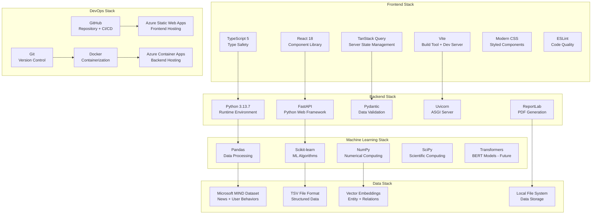
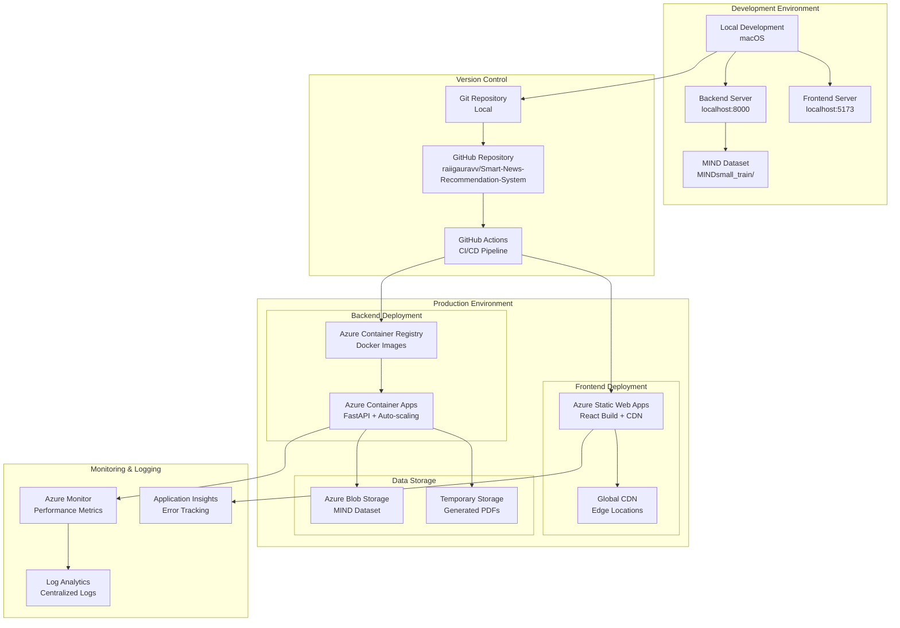
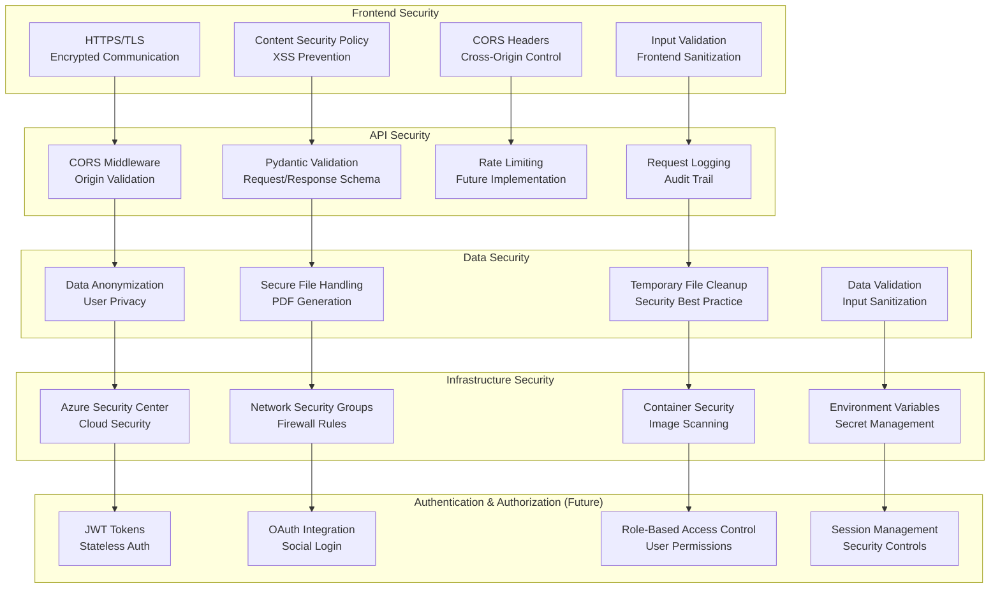
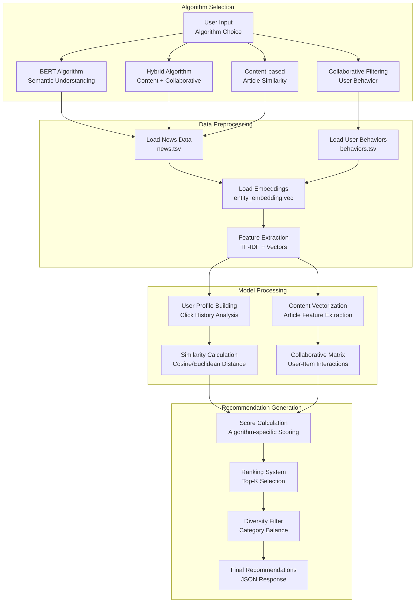
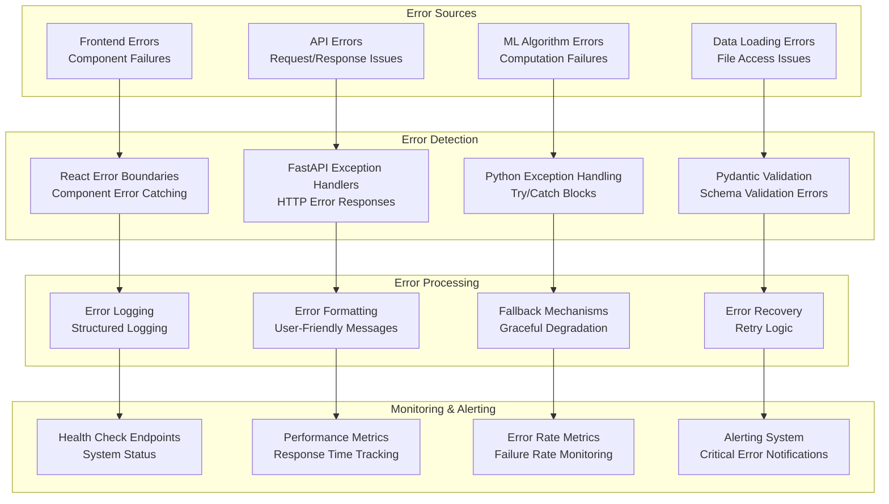

# Smart News Recommendation System - System Diagrams# System Architecture Overview


## High-Level System Design## High-Level System Design


```mermaid```mermaid

graph TBgraph TB

    subgraph "Client Layer"    subgraph "Client Layer"

        Web[Web Browser<br/>React SPA]        Web[Web Browser<br/>React SPA]

        Mobile[Mobile App<br/>Future]        Mobile[Mobile App<br/>Future]

        API_Client[API Clients<br/>Third Party]    end

    end    

        subgraph "CDN & Static Hosting"

    subgraph "CDN & Static Hosting"        Azure[Azure Static Web Apps<br/>React Build + CDN]

        Vite[Vite Dev Server<br/>localhost:5173]    end

        Azure[Azure Static Web Apps<br/>Production CDN]    

    end    subgraph "API Gateway"

            Gateway[Azure Application Gateway<br/>Load Balancer + SSL]

    subgraph "API Gateway"    end

        FastAPI[FastAPI Server<br/>localhost:8000]    

        CORS[CORS Middleware<br/>Cross-Origin Support]    subgraph "Application Layer"

    end        FastAPI[FastAPI Server<br/>Azure Container Apps]

            subgraph "Services"

    subgraph "Application Layer"            RecEngine[Recommendation Engine]

        subgraph "Core Services"            SearchSvc[Search Service]

            RecEngine[Recommendation Engine<br/>4 ML Algorithms]            PDFSvc[PDF Generation]

            SearchSvc[Search Service<br/>Keyword + Category]            Analytics[Analytics Service]

            PDFSvc[PDF Generation<br/>ReportLab]        end

            HealthSvc[Health Check<br/>System Status]    end

        end    

        subgraph "Business Logic"    subgraph "Data Layer"

            Adapters[Service Adapters<br/>Data Processing]        MIND[MIND Dataset<br/>News + Behaviors]

            Schemas[Pydantic Schemas<br/>Validation]        Embeddings[Entity/Relation<br/>Embeddings]

            Settings[Configuration<br/>Environment]        Cache[Redis Cache<br/>Future]

        end    end

    end    

        Web --> Azure

    subgraph "Data Layer"    Mobile --> Azure

        MIND[MIND Dataset<br/>News + Behaviors]    Azure --> Gateway

        NewsData[news.tsv<br/>51k+ Articles]    Gateway --> FastAPI

        BehaviorData[behaviors.tsv<br/>User Interactions]    FastAPI --> RecEngine

        Embeddings[Entity/Relation<br/>Embeddings.vec]    FastAPI --> SearchSvc

        TempStorage[Temporary Storage<br/>PDFs + Cache]    FastAPI --> PDFSvc

    end    FastAPI --> Analytics

        RecEngine --> MIND

    Web --> Vite    RecEngine --> Embeddings

    Mobile --> Azure    SearchSvc --> MIND

    API_Client --> FastAPI    PDFSvc --> MIND

    Vite --> FastAPI    Analytics --> Cache

    Azure --> FastAPI```

    FastAPI --> CORS

    CORS --> RecEngine## Data Flow Architecture

    CORS --> SearchSvc

    CORS --> PDFSvc```mermaid

    CORS --> HealthSvcsequenceDiagram

        participant U as User

    RecEngine --> Adapters    participant F as Frontend

    SearchSvc --> Adapters    participant A as API Gateway

    PDFSvc --> Adapters    participant B as Backend

        participant ML as ML Engine

    Adapters --> Schemas    participant D as Data Layer

    Adapters --> Settings    

    Adapters --> MIND    U->>F: Search/Browse Request

        F->>A: HTTP Request

    MIND --> NewsData    A->>B: Route to FastAPI

    MIND --> BehaviorData    B->>ML: Process Request

    MIND --> Embeddings    ML->>D: Load Data

    PDFSvc --> TempStorage    D-->>ML: Return Data

```    ML-->>B: Generate Recommendations

    B-->>A: JSON Response

## Recommendation Engine Architecture    A-->>F: API Response

    F-->>U: Render Results

```mermaid    

graph LR    Note over U,D: Real-time recommendation flow

    subgraph "User Input"```

        UserID[User ID<br/>String]

        Algorithm[Algorithm Choice<br/>bert/hybrid/collaborative/content]## Component Interaction Diagram

        Limit[Result Limit<br/>Default: 10]

    end```mermaid

    graph LR

    subgraph "Algorithm Engines"    subgraph "Frontend Components"

        BERT[BERT-based<br/>Transformer Models<br/>Semantic Analysis]        Home[Home Component]

        Hybrid[Hybrid System<br/>Content + Collaborative<br/>Weighted Scoring]        Search[Search Container]

        Collaborative[Collaborative Filtering<br/>User-Item Matrix<br/>SVD Decomposition]        Articles[Article Grid]

        ContentBased[Content-based<br/>TF-IDF Vectors<br/>Cosine Similarity]        PDF[PDF Export Button]

    end    end

        

    subgraph "Data Processing"    subgraph "API Layer"

        DataLoader[Data Loader<br/>MIND Dataset]        API[FastAPI Router]

        FeatureEngine[Feature Engineering<br/>TF-IDF + Embeddings]        Adapters[Service Adapters]

        UserProfile[User Profile<br/>Behavior Analysis]    end

        ArticleIndex[Article Index<br/>Content Vectors]    

    end    subgraph "Business Logic"

            Recommender[Recommendation Engine]

    subgraph "Output Processing"        PDFGen[PDF Generator]

        Ranking[Relevance Ranking<br/>Score Calculation]        DataLoader[Data Loader]

        Formatting[Response Formatting<br/>JSON Structure]    end

        Deduplication[Duplicate Removal<br/>Unique Articles]    

    end    subgraph "Data Sources"

            News[News TSV]

    UserID --> BERT        Behaviors[Behaviors TSV]

    UserID --> Hybrid        Entities[Entity Embeddings]

    UserID --> Collaborative    end

    UserID --> ContentBased    

        Home --> Search

    Algorithm --> BERT    Search --> Articles

    Algorithm --> Hybrid    Home --> PDF

    Algorithm --> Collaborative    

    Algorithm --> ContentBased    Search --> API

        PDF --> API

    BERT --> DataLoader    

    Hybrid --> DataLoader    API --> Adapters

    Collaborative --> DataLoader    Adapters --> Recommender

    ContentBased --> DataLoader    Adapters --> PDFGen

        

    DataLoader --> FeatureEngine    Recommender --> DataLoader

    DataLoader --> UserProfile    PDFGen --> DataLoader

    DataLoader --> ArticleIndex    

        DataLoader --> News

    FeatureEngine --> Ranking    DataLoader --> Behaviors

    UserProfile --> Ranking    DataLoader --> Entities

    ArticleIndex --> Ranking```

    

    Ranking --> Formatting## Technology Stack Diagram

    Formatting --> Deduplication

``````mermaid

graph TB

## Data Flow Architecture    subgraph "Frontend Stack"

        React[React 18 + TypeScript]

```mermaid        Vite[Vite Build Tool]

sequenceDiagram        StyledComponents[Styled Components]

    participant U as User Browser        ReactQuery[React Query]

    participant F as React Frontend        FramerMotion[Framer Motion]

    participant A as FastAPI Backend    end

    participant ML as ML Engine    

    participant D as MIND Dataset    subgraph "Backend Stack"

    participant P as PDF Generator        FastAPI[FastAPI Framework]

            Python[Python 3.11+]

    Note over U,P: Search Flow        Pandas[Pandas + NumPy]

    U->>F: Enter search query + category        Sklearn[Scikit-learn]

    F->>A: POST /search        ReportLab[ReportLab PDF]

    A->>ML: Process search request    end

    ML->>D: Query news.tsv    

    D-->>ML: Return matching articles    subgraph "DevOps Stack"

    ML-->>A: Formatted search results        Docker[Docker Containers]

    A-->>F: JSON response        Azure[Azure Cloud Platform]

    F-->>U: Display article cards        GitHub[GitHub Actions CI/CD]

            StaticApps[Azure Static Web Apps]

    Note over U,P: Recommendation Flow        ContainerApps[Azure Container Apps]

    U->>F: Select algorithm + User ID    end

    F->>A: POST /recommend    

    A->>ML: Generate recommendations    subgraph "Data Stack"

    ML->>D: Load user behaviors + news        MIND[Microsoft MIND Dataset]

    D-->>ML: User history + article data        TSV[TSV File Format]

    ML-->>A: Personalized recommendations        Embeddings[Pre-trained Embeddings]

    A-->>F: Recommendation list        FileSystem[Local File System]

    F-->>U: Show personalized feed    end

        

    Note over U,P: PDF Export Flow    React --> FastAPI

    U->>F: Click "Export PDF"    FastAPI --> MIND

    F->>A: POST /export/pdf    Docker --> Azure

    A->>P: Generate PDF report    GitHub --> Azure

    P->>D: Get article details```

    D-->>P: Full article metadata

    P-->>A: PDF file binary## Deployment Pipeline

    A-->>F: File download response

    F-->>U: Download PDF report```mermaid

```graph LR

    subgraph "Development"

## Component Interaction Diagram        Dev[Local Development]

        Git[Git Repository]

```mermaid    end

graph TB    

    subgraph "Frontend Components (React + TypeScript)"    subgraph "CI/CD Pipeline"

        App[App.tsx<br/>Main Router]        Actions[GitHub Actions]

        Home[Home.tsx<br/>Search + Trending]        Build[Build & Test]

        Recommend[Recommend.tsx<br/>Algorithm Selection]        Deploy[Deploy to Azure]

        ArticleCard[ArticleCard.tsx<br/>Article Display]    end

        StyledComponents[StyledComponents.tsx<br/>UI Library]    

    end    subgraph "Production"

            Frontend[Azure Static Web Apps]

    subgraph "API Integration Layer"        Backend[Azure Container Apps]

        APIClient[API Client<br/>Fetch Wrapper]        CDN[Global CDN]

        ReactQuery[TanStack Query<br/>State Management]    end

        ErrorBoundary[Error Boundary<br/>Error Handling]    

    end    Dev --> Git

        Git --> Actions

    subgraph "Backend API Routes (FastAPI)"    Actions --> Build

        HealthRoute[GET /health<br/>System Status]    Build --> Deploy

        TrendingRoute[GET /trending<br/>Popular Articles]    Deploy --> Frontend

        RecommendRoute[POST /recommend<br/>ML Recommendations]    Deploy --> Backend

        SearchRoute[POST /search<br/>Keyword Search]    Frontend --> CDN

        PDFRoute[POST /export/pdf<br/>PDF Generation]```

    end

    ## Security Architecture

    subgraph "Service Adapters"

        RecommendAdapter[Recommendation Adapter<br/>ML Integration]```mermaid

        SearchAdapter[Search Adapter<br/>Query Processing]graph TB

        PDFAdapter[PDF Adapter<br/>Report Generation]    subgraph "Security Layers"

        DataAdapter[Data Adapter<br/>MIND Dataset]        SSL[SSL/TLS Encryption]

    end        CORS[CORS Policy]

            CSP[Content Security Policy]

    subgraph "Utility Services"        Validation[Input Validation]

        Recommenders[utils/recommenders.py<br/>4 ML Algorithms]        RateLimit[Rate Limiting]

        PDFUtils[utils/pdf_utils.py<br/>ReportLab Integration]    end

        BERT4Rec[utils/bert4rec.py<br/>BERT Implementation]    

    end    subgraph "Application Security"

            Auth[Authentication Future]

    App --> Home        Authorization[Authorization Future]

    App --> Recommend        DataAnonymization[Data Anonymization]

    Home --> ArticleCard        SecureHeaders[Security Headers]

    Recommend --> ArticleCard    end

    ArticleCard --> StyledComponents    

        subgraph "Infrastructure Security"

    Home --> APIClient        AzureSecurity[Azure Security Center]

    Recommend --> APIClient        NetworkSecurity[Network Security Groups]

    APIClient --> ReactQuery        ContainerSecurity[Container Security]

    ReactQuery --> ErrorBoundary        SecretManagement[Azure Key Vault Future]

        end

    APIClient --> HealthRoute    

    APIClient --> TrendingRoute    SSL --> CORS

    APIClient --> RecommendRoute    CORS --> CSP

    APIClient --> SearchRoute    CSP --> Validation

    APIClient --> PDFRoute    Validation --> RateLimit

        

    RecommendRoute --> RecommendAdapter    Auth --> Authorization

    SearchRoute --> SearchAdapter    Authorization --> DataAnonymization

    PDFRoute --> PDFAdapter    DataAnonymization --> SecureHeaders

    TrendingRoute --> DataAdapter    

        AzureSecurity --> NetworkSecurity

    RecommendAdapter --> Recommenders    NetworkSecurity --> ContainerSecurity

    PDFAdapter --> PDFUtils    ContainerSecurity --> SecretManagement

    RecommendAdapter --> BERT4Rec```
    SearchAdapter --> Recommenders
```

## Technology Stack Diagram



## Deployment Architecture



## Security Architecture



## Algorithm Flow Diagram



## Error Handling & Monitoring Flow

