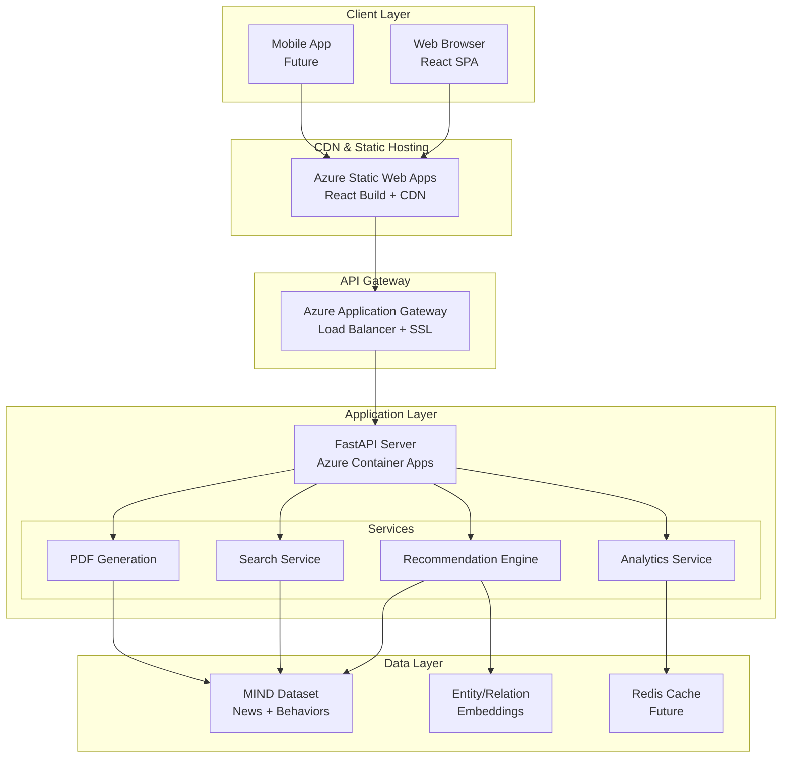
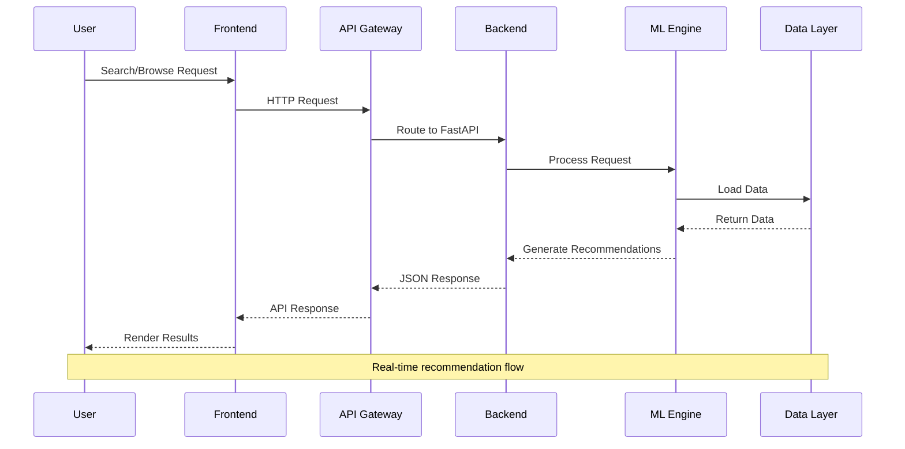
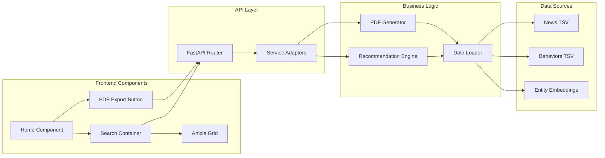
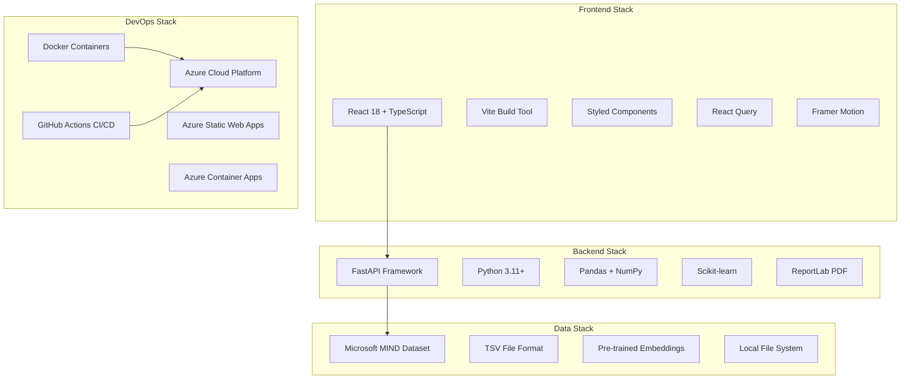
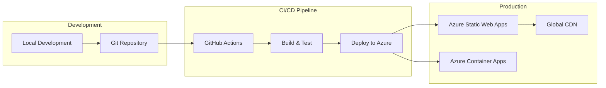

# System Architecture Overview

## High-Level System Design

## Data Flow Architecture

## Component Interaction Diagram

## Technology Stack Diagram

## Deployment Pipeline

## Security Architecture

```mermaid
graph TB
    subgraph "Security Layers"
        SSL[SSL/TLS Encryption]
        CORS[CORS Policy]
        CSP[Content Security Policy]
        Validation[Input Validation]
        RateLimit[Rate Limiting]
    end
    
    subgraph "Application Security"
        Auth[Authentication Future]
        Authorization[Authorization Future]
        DataAnonymization[Data Anonymization]
        SecureHeaders[Security Headers]
    end
    
    subgraph "Infrastructure Security"
        AzureSecurity[Azure Security Center]
        NetworkSecurity[Network Security Groups]
        ContainerSecurity[Container Security]
        SecretManagement[Azure Key Vault Future]
    end
    
    SSL --> CORS
    CORS --> CSP
    CSP --> Validation
    Validation --> RateLimit
    
    Auth --> Authorization
    Authorization --> DataAnonymization
    DataAnonymization --> SecureHeaders
    
    AzureSecurity --> NetworkSecurity
    NetworkSecurity --> ContainerSecurity
    ContainerSecurity --> SecretManagement
```

